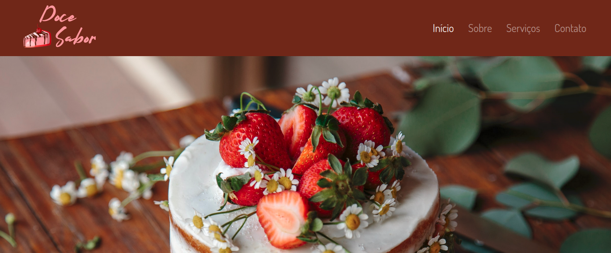
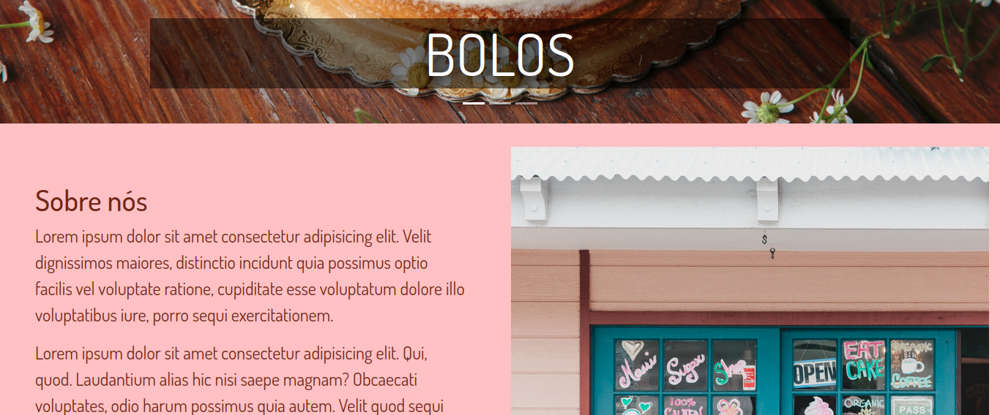
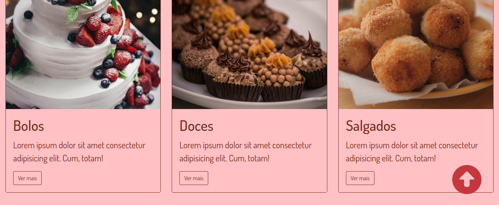
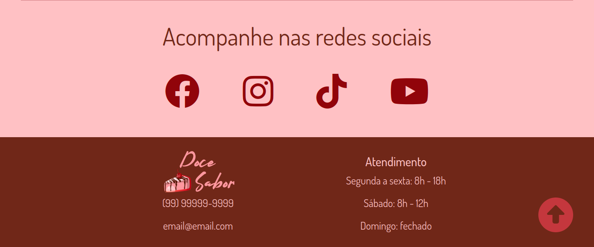
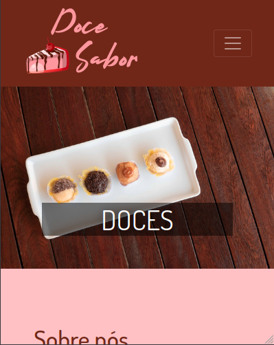
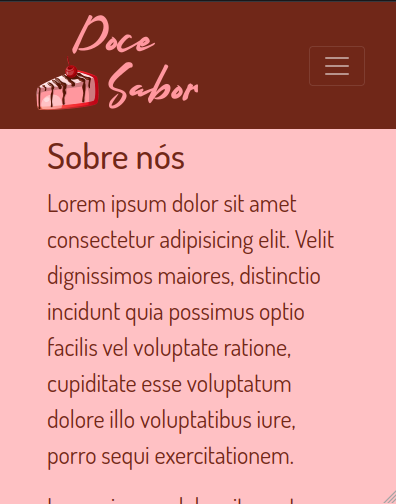
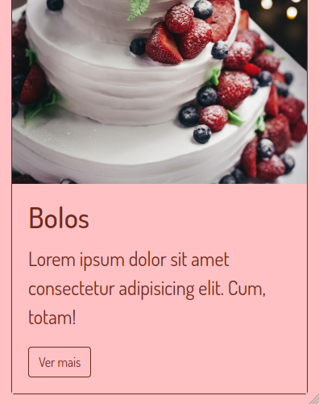
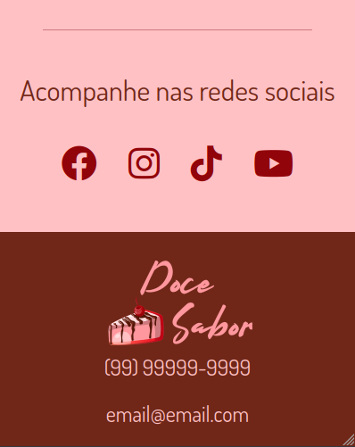

# Doce Sabor :cake:

Este projeto apresenta um site responsivo estilo One Page utilizando o framework Bootstrap, versão 4, na estilização. 

O negócio apresentado é a doceria Doce Sabor. Assim, é apresentada a sua história, serviços prestados e as informações de contato.

## :gear: Tecnologias

- HTML
- CSS
- Bootstrap
- JavaScript

## :art: Layout

